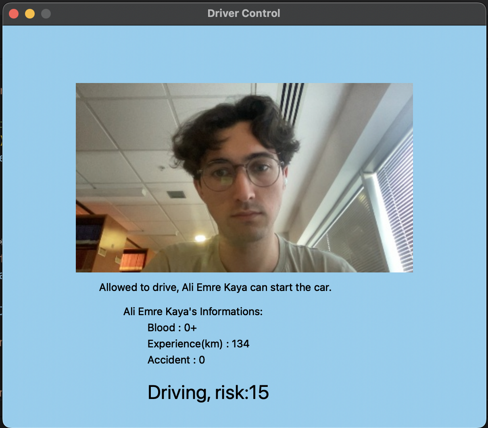

# driver-control

In this project I use OpenCV for recognize the driver. 
If driver is alreay be registered in the car, car can able to run, otherwise can't. 
After car run, driver's informations will show on the screen. 
While driving, if driver is anger or drivers risk ratio is more than the limit, car gives a caution.

   

Sample Output1 :  

 
